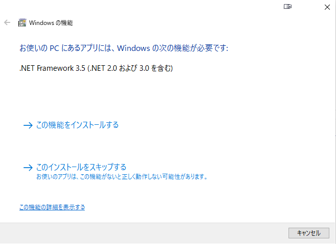
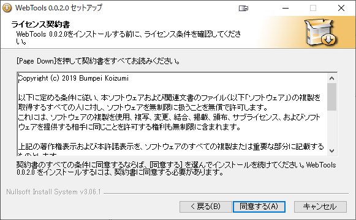
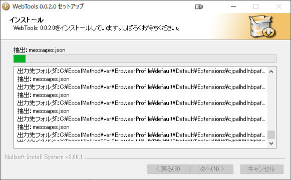

# webTools For Excel 2016 Macro

-0078D6.svg?logo=windows&style=flat)
-217346.svg?logo=microsoft-excel&style=flat)

## 動作環境
* Windows 10 64Bit
* Microsoft Office 2016 32Bit
* .Net Framework 2.0.50727
* Google chrome

## インストール方法

|&nbsp;|&nbsp;|
|---|---|
|1. ExcelなどのOffice関連をすべて終了させてください|&nbsp;|
|2. WebTools_XXX.exe  をダブルクリックし実行する( XXXはバージョン番号)|&nbsp;|
|3. .Net Framework 2.0がインストールされていない場合は、インストールに移行します。 再起動後、インストールをやり直してください||
|4. セットアップウィザードに従い続行||
|5. 利用規約に同意 同意できない場合は、キャンセルで終了させてください||
|6. インストールするコンポーネントを選択||
|7. 処理完了まで待機||
|8. インストール完了||

## 利用方法

スタートメニューから Web Toolsを実行  

専用のリボンメニューを設置  

### キャプチャ処理実行方法

キャプチャ対象URLは、シート『WebCaptureList』に記載  
**A列**   サイトURL  　**B列**   出力するシート名  

リストの準備ができれば、リボンメニューのキャプチャボタン  をクリックすると処理が開始します。

### 出力結果
  

## 参考サイト
[Excelでお仕事!](http://www.ne.jp/asahi/excel/inoue/)  
[moug モーグ](https://www.moug.net/)  
[Office TANAKA](http://officetanaka.net)  
[エクセルの神髄](https://excel-ubara.com/)  
